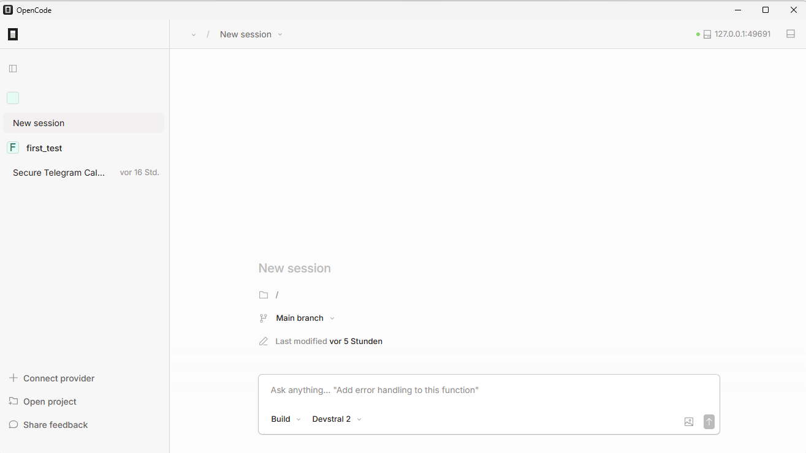

# OpenCode – Usage Guide (Desktop)

Dieser Guide erklärt die **grundlegende Nutzung von OpenCode Desktop**.
Der Fokus liegt auf der **UI**, den **Arbeitsmodi (Plan / Build)** und **Best Practices** für Co-Coding.

---

## 1. Mental Model: Wie OpenCode arbeitet

OpenCode ist **kein Editor und kein Autocomplete**.

Stattdessen:

- ein **AI Coding Agent**
- arbeitet auf **Repository-Ebene**
- denkt in **Aufgaben, Plänen und Umsetzungsschritten**
- ideal für **größere Coding-Tasks & Refactorings**

👉 Ziel ist **gemeinsames Arbeiten mit dem Agenten**, nicht Einmal-Prompts.

---

## 2. Die OpenCode Oberfläche

### 2.1 Linke Sidebar

Die Sidebar ist dein **Arbeits- & Navigationszentrum**.

Hier findest du:

- **Sessions**
  - *New session* → neue Aufgabe starten
  - bestehende Sessions → Verlauf & Kontext
- **Projects**
  - geöffnete Ordner / Repositories
- **Provider**
  - Verbindung zu LLMs (z. B. Mistral, OpenAI)

💡 **Best Practice:**  
Eine Session = **eine Aufgabe / ein Ziel**  
(z. B. „TicTacToe bauen“, „Code refactoren“, „Projekt analysieren“)

---

### 2.2 Chat-Fenster (Zentrale Arbeitsfläche)

Das Chat-Fenster ist der **primäre Arbeitsbereich**.

Hier passiert:

- Aufgabenbeschreibung in natürlicher Sprache
- Planung durch den Agenten
- Umsetzung (File-Changes, neue Dateien)
- Iteration & Feedback

Der Chat ist **zustandsbehaftet**:
- OpenCode merkt sich Kontext
- vorherige Entscheidungen fließen ein

---

## 3. Plan- & Build-Mode (wichtig!)

Unten im Chat kannst du zwischen zwei Modi wechseln:

---

### 🧠 Plan Mode

**Wann nutzen?**

- neue Aufgabe
- unklare Anforderungen
- Architektur & Struktur

**Was passiert?**

- Agent analysiert Kontext
- schlägt Vorgehen vor
- erstellt einen **konkreten Plan**
- **keine Code-Änderungen**

**Beispiel:**

> „Plane ein einfaches TicTacToe-Spiel in Python mit sauberer Struktur.“

---

### 🛠️ Build Mode

**Wann nutzen?**

- wenn der Plan klar ist
- wenn Code erstellt oder geändert werden soll

**Was passiert?**

- Dateien werden angelegt / geändert
- Schritte sind transparent
- Änderungen können diskutiert werden

**Beispiel:**

> „Setze den Plan jetzt um.“

💡 **Best Practice:**  
👉 **Erst Plan, dann Build**  
Das reduziert Fehlversuche und Chaos.

---

## 4. Agentisches Arbeiten (Hintergrund)

Auch wenn man es im Desktop nicht explizit sieht:

- OpenCode nutzt intern **Agenten**
- diese können:
  - planen
  - Code schreiben
  - analysieren
  - Regeln & Skills berücksichtigen

Für den Workshop wichtig:
👉 **Du musst keine Agenten definieren** – das passiert implizit.

---

## 5. Regeln, Skills & Tools (vereinfachte Sicht)

Viele OpenCode-Docs beziehen sich auf die CLI.
Für Desktop gilt:

### Rules
- steuern **Stil, Verhalten & Constraints**
- z. B. „schreibe sauberen Code“, „keine externen Libs“

➡️ Im Workshop meist **implizit ausreichend**  
(du kannst Regeln auch einfach im Chat formulieren)

---

### Skills
- wiederverwendbare Fähigkeiten (z. B. Analyse, Refactoring)
- im Desktop **automatisch genutzt**

➡️ Kein manuelles Setup nötig.

---

### Tools / MCP / LSP
- ermöglichen Datei- & Projektzugriff sowie erweiterte Funktionen (für den Workshop aber nicht weiter relevant)
- sind im Desktop **bereits integriert**

---

## 6. Typische Prompts (Desktop-tauglich)

### Analyse

> „Analysiere dieses Projekt und erkläre mir die Struktur.“

### Feature

> „Erstelle eine einfache Python-App für TicTacToe.“

### Refactoring

> „Vereinfache die Struktur und trenne Logik von UI.“

### Lernen

> „Erkläre mir den Code Schritt für Schritt.“

---

## 7. Best Practices für Coding mit OpenCode

- **Eine Session = ein Ziel**
- **Erst planen, dann bauen**
- Große Aufgaben in **Teilaufgaben zerlegen**
- Feedback geben:
  - „Das gefällt mir nicht“
  - „Mach es einfacher“

---

## 8. Wann OpenCode ideal ist

✅ Feature-Implementierungen  
✅ Refactorings  
✅ Prototyping  
✅ Lernen durch Dialog  

❌ Autocomplete  
❌ schnelles UI-Finetuning  

---

## 9. Weiterführende Infos (optional)

- Docs: https://opencode.ai/docs
- Models: https://opencode.ai/docs/models/
- Agents: https://opencode.ai/docs/agents/

---
